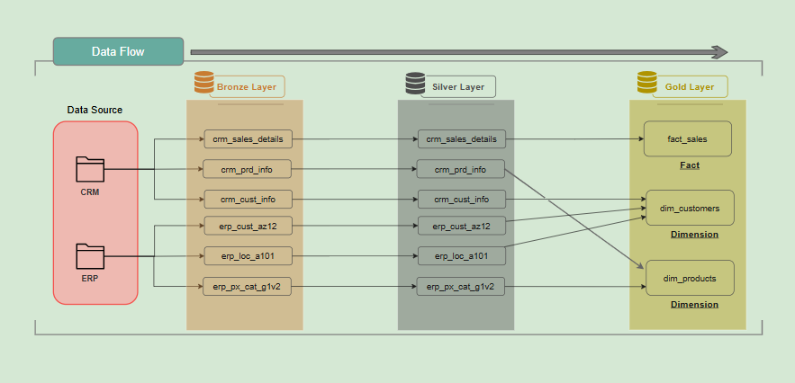
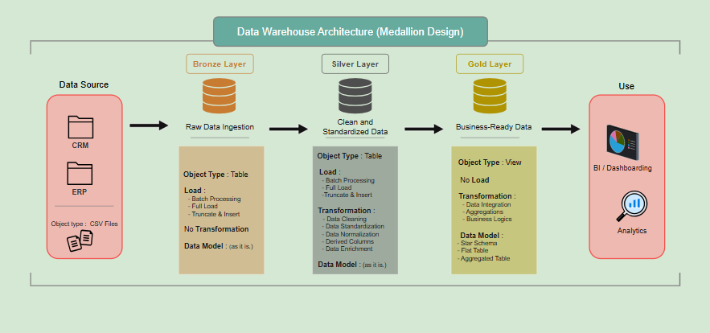
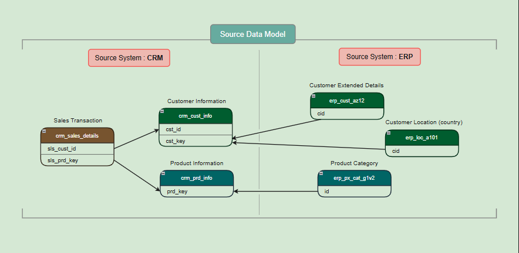
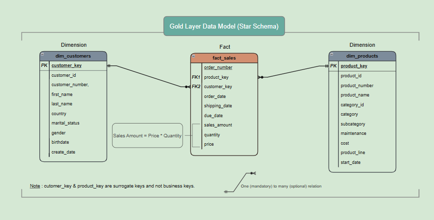

# 🏗️ Data Warehouse Project (SQL + Python | Medallion Architecture)

## 🧩 Overview
This project implements a structured **data warehouse pipeline** using the **Medallion Architecture (Bronze → Silver → Gold)**. It integrates data from CRM and ERP systems, applies transformations, and delivers analytics-ready datasets via a **star schema**.

Built using **MySQL** and **Python (SQLAlchemy + Pandas)**, the pipeline is modular, reproducible, and designed with data quality and scalability in mind.

---

## 📌 Quick Summary

| | |
|---|---|
| **Architecture** | Medallion (Bronze → Silver → Gold) |
| **Database** | MySQL |
| **Language** | SQL, Python (SQLAlchemy, Pandas) |
| **Data Sources** | CRM system + ERP system (6 source files) |
| **Output** | Star schema — `dim_customers`, `dim_products`, `fact_sales` |

---

## 🎯 Purpose
The project aims to unify sales data distributed across two disconnected systems—**CRM** and **ERP**—into a single, analytics-ready data model.

- **CRM** provides customer profiles, product catalog, and transaction records  
- **ERP** provides customer demographics, location data, and product category mappings  

Due to the lack of integration, there was no consistent view of sales performance. Basic analytical queries, such as revenue by region and product category ,required manual data extraction and joins.

This pipeline addresses that gap by automating the end-to-end data flow, transforming raw source data into a structured star schema optimized for analysis.



---

## 🏗️ Architecture  



### 🟤 Bronze Layer (Raw)
- Raw ingestion from CSV files  
- No transformations applied  
- Maintains source fidelity for traceability  

### ⚪ Silver Layer (Cleansed)
- Data cleaning and standardization  
- Handles nulls, inconsistencies, and derived fields  
- Prepares structured datasets  

### 🟡 Gold Layer (Business)
- Implements **star schema**  
- Analytical views for reporting:
  - `dim_customers`
  - `dim_products`
  - `fact_sales`

---

## 📂 Data Sources

### CRM
- `cust_info.csv` → Customer data  
- `prd_info.csv` → Product data  
- `sales_details.csv` → Sales transactions  

### ERP
- `CUST_AZ12.csv` → Customer demographics  
- `LOC_A101.csv` → Customer location  
- `PX_CAT_G1V2.csv` → Product categories  



---

## ⚙️ Implementation

### 🟤 Bronze Layer
Loads all six source CSVs into MySQL without transformation, preserving exact source data for traceability and reprocessing.
- **DDL:** `bronze_ddl.sql`  
- **Script:** `bronze_load.py`  

**Details:**
- Creates `bronze` database and source-aligned tables  
- Performs bulk ingestion using `LOAD DATA LOCAL INFILE`  
- Stores raw data without transformation  

**Naming Convention:** 
Bronze tables follow a standardized naming pattern to preserve source lineage and ensure clarity across layers:  
bronze.<source_system>_<entity_name>  (e.g. `bronze.crm_cust_info`)  

**Where:**
- `<source_system>` → Source identifier (`crm`, `erp`)  
- `<entity_name>` → Derived from source file name (lowercased and normalized)  

---

### ⚪ Silver Layer
Extracts from Bronze and applies transformation logic before loading into clean Silver tables.
- **DDL:** `silver_ddl.sql`  
- **Script:** `silver_etl.py`  

**Details:**
- Extracts data from Bronze layer  
- Applies transformations:
  - Data cleaning  
  - Null and invalid value handling  
  - Standardization across sources  
- Loads processed data into Silver tables  

---

### 🟡 Gold Layer
Builds analytical views by joining Silver tables into a clean dimensional model.
- **DDL:** `gold_ddl.sql`  

**Details:**
- Creates analytical views based on star schema  

**Data Model:**
- **Schema Type:** Star Schema 
- **Dimensions:**
  - `dim_customers`
  - `dim_products`
- **Fact Table:**
  - `fact_sales`
  - Fact table is built by joining:
    - `silver.crm_sales_details`
    - Customer and product dimension tables  




---

## 🔑 Key Design Decisions

**Why Medallion Architecture?** Each layer serves a distinct purpose — Bronze for auditability, Silver for clean consumption, Gold for analytics. This separation means a bad transformation in Silver never corrupts raw data, and re-running any single layer is safe and isolated.

**Why MySQL views for Gold?** Views ensure the gold layer always reflects the latest Silver data without a separate load step — reducing pipeline complexity and storage overhead for this project's scale.

**Why bulk ingestion over row-by-row inserts?** `LOAD DATA LOCAL INFILE` cut Bronze ingestion time by ~80% compared to SQLAlchemy row inserts during testing.  

---

## ✅ Data Quality Checks

Validation scripts run after Silver and Gold loads to ensure data consistency and reliability.

**Silver-layer checks (`silver_quality_check.sql`):**

- Validate primary keys — detect nulls and duplicates in customer and product IDs  
- Enforce data cleanliness — identify unwanted spaces in text fields  
- Ensure referential integrity — sales, ERP, and CRM records must map correctly across tables  
- Verify business logic — check `sales = quantity × price` and ensure all values are positive  
- Validate dates — enforce valid ranges and correct chronological order (order ≤ ship ≤ due)

**Gold-layer checks (`gold_quality_check.sql`):**

- Validate dimension keys — detect nulls and duplicates in customer and product surrogate keys  
- Ensure data cleanliness — identify unwanted spaces and inconsistent text values  
- Verify business rules — enforce logic such as `sales_amount = quantity × price` and valid customer ID mappings  
- Validate attribute logic — check constraints like `birthdate < create_date`  
- Ensure model integrity — confirm proper linkage between fact and dimension tables    

---

## 📝 Logging & Monitoring
Centralized logging is implemented across ETL pipelines to provide execution visibility, traceability, and faster failure diagnosis.

- Captures end-to-end pipeline events — extraction, transformation, and load stages  
- Records execution status (start, success, failure) for each table/process  
- Enables quick identification of failure points and data issues  
- Log files generated per layer: `logs_bronze_load.log`, `logs_silver_etl.log`  
- Supports debugging, auditability, and operational monitoring of the pipeline   

---

## 🚀 Getting Started

### Prerequisites

- MySQL 8.0+
- Python 3.9+
- Required Python packages:

```bash
pip install sqlalchemy pandas pymysql python-dotenv
```

### Setup

**1. Clone the repository**
```bash
git clone https://github.com/surajsnew25/data-warehouse-project.git
cd data-warehouse-project
```

**2. Configure database connection**

Create a `.env` file in the project root:
```
DB_HOST=localhost
DB_USER=your_username
DB_PASSWORD=your_password
```

**3. Run the pipeline**

Execute each layer in order:

```bash
# Bronze — create tables and load raw data
mysql -u $DB_USER -p < scripts/01_bronze/bronze_ddl.sql
python scripts/01_bronze/bronze_load.py

# Silver — clean and transform
mysql -u $DB_USER -p < scripts/02_silver/silver_ddl.sql
python scripts/02_silver/silver_etl.py

# Gold — create analytical views
mysql -u $DB_USER -p < scripts/03_gold/gold_ddl.sql
```

**4. Run quality checks **

```bash
mysql -u $DB_USER -p < tests/silver_quality_check.sql
mysql -u $DB_USER -p < tests/gold_quality_check.sql
```

---

## 🧰 Tech Stack
- **Database:** MySQL — create, stores tables and analytical views  
- **Language:** Python — drives ETL pipeline orchestration and transformations  
- **Libraries:** SQLAlchemy, Pandas — database interaction and data processing  
- **Tools:** draw.io — data modeling and architecture diagrams  

---

## 📁 Project Structure

    data-warehouse-project/  
    │  
    ├── datasets/  
    │   ├── source_crm/  
    │   │   ├── cust_info.csv        <-- Customer information data  
    │   │   ├── prd_info.csv         <-- Product information data  
    │   │   └── sales_details.csv    <-- Sales transactions details  
    │   │  
    │   └── source_erp/  
    │       ├── CUST_AZ12.csv        <-- Customer demographic details  
    │       ├── LOC_A101.csv         <-- Customer location details  
    │       └── PX_CAT_G1V2.csv      <-- Product category mapping  
    │  
    ├── scripts/  
    │   ├── 01_bronze/  
    │   │   ├── bronze_ddl.sql        <-- SQL script file to create and define database/tables  
    │   │   └── bronze_load.py        <-- Python script file for data ingestion  
    │   │  
    │   ├── 02_silver/  
    │   │   ├── silver_ddl.sql         <-- SQL script file to create and define database/tables  
    │   │   └── silver_etl.py         <-- Python script file to extract , transform and load data  
    │   │  
    │   └── 03_gold/  
    │       └── gold_ddl.sql           <-- SQL script file to create and define database/views  
    │  
    ├── tests/  
    │   ├── silver_quality_check.sql   <-- SQL queries to perform data quality checks  
    │   └── gold_quality_check.sql  
    │  
    ├── docs/  
    │   ├── architecture_diagram.png  
    │   ├── data_flow_diagram.png  
    │   ├── source_data_model.png  
    │   ├── gold_data_model.png  
    │   └── gold_layer_data_dictionary.md        <-- Data dictionary for gold layer      
    │  
    ├── logs/  
    │   ├── logs_bronze_load.log         <-- logs for bronze layer data ingestion python script  
    │   └── logs_silver_etl.log          <-- logs for silver layer etl python script  
    │
    └── README.md               <-- Readme for this project

---

## 📄 Documentation

- [Architecture Diagram](docs/architecture_diagram.png)
- [Data Flow Diagram](docs/data_flow_diagram.png)
- [Source Data Model](docs/source_data_model.png)
- [Gold Layer Data Model](docs/gold_data_model.png)
- [Gold Layer Data Dictionary](docs/gold_layer_data_dictionary.md)

---

## 📊 Sample Analytical Queries

Once the pipeline runs, the gold layer supports queries like:

```sql
-- Top 5 products by Revenue
select
	dp.product_name,
    sum(fs.sales_amount) as total_sales
from gold.dim_products dp
join gold.fact_sales fs
	on dp.product_key = fs.product_key
group by dp.product_name
order by total_sales desc
limit 5;
```

```sql
-- customer spending behaviour segmentation (VIP, Regular, New)
select 
	segment,
	count(customer_key) as total_customers
from(
	select
		dc.customer_key,
		dc.first_name,
		sum(fs.sales_amount) as spend,
		timestampdiff(month, min(fs.order_date), max(fs.order_date)) as hist,
		case when timestampdiff(month, min(fs.order_date), max(fs.order_date)) >= 12
					and sum(fs.sales_amount) > 5000 then 'VIP'
			when timestampdiff(month, min(fs.order_date), max(fs.order_date)) >= 12
					and sum(fs.sales_amount) <= 5000 then 'Regular'
			else 'New'
		end as segment
	from gold.dim_customers dc
	join gold.fact_sales fs
		on dc.customer_key = fs.customer_key
	group by dc.customer_key, dc.first_name
	order by dc.customer_key ) as t
    group by segment;

```

---